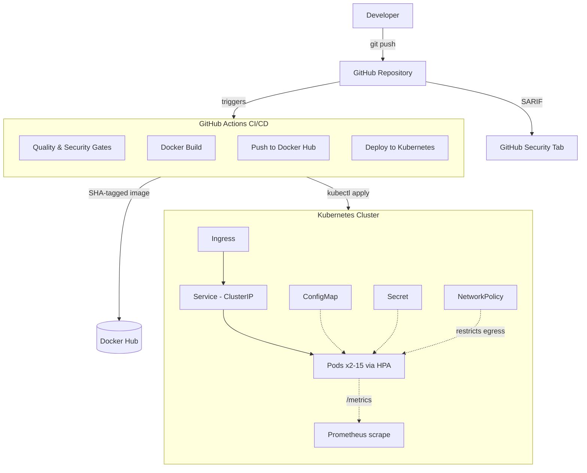
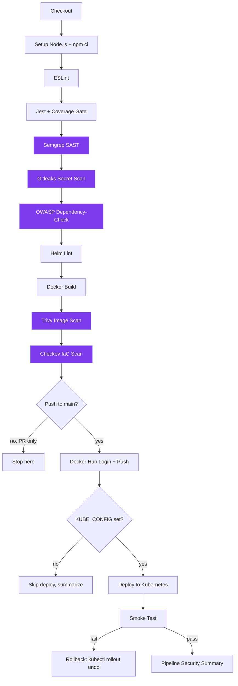

# Enterprise DevSecOps CI/CD Pipeline


A production-shaped Secure Software Development Lifecycle (SSDLC) reference implementation: a small Node.js/Express service wrapped in a CI/CD pipeline that gates every merge on SAST, secret scanning, dependency CVEs, container image CVEs, and Infrastructure-as-Code misconfigurations before it's allowed anywhere near a cluster.

This is not a tutorial scaffold. Every gate described below was run against this repository's own code, found real issues, and is enforced in [`.github/workflows/ci.yaml`](.github/workflows/ci.yaml) today — including a live supply-chain compromise this project's own CI dependencies were exposed to (see [Security Features](#security-features)).

---

## Table of Contents

- [Architecture](#architecture)
- [CI/CD Pipeline](#cicd-pipeline)
- [Folder Structure](#folder-structure)
- [Technologies](#technologies)
- [Application Endpoints](#application-endpoints)
- [Security Features](#security-features)
- [Setup Instructions](#setup-instructions)
- [Kubernetes & Helm](#kubernetes--helm)
- [Environment Variables](#environment-variables)
- [Known Trade-offs](#known-trade-offs)
- [Interview Questions](#interview-questions)

---

## Architecture



The application itself is deliberately simple — a single Express app (`app/app.js`) with Helmet, structured JSON logging, rate limiting, graceful shutdown, and `/health`, `/ready`, `/version`, `/metrics` endpoints. The complexity here is intentionally in the pipeline and platform around it, which is what this repo is demonstrating.

## CI/CD Pipeline



Every gate stage (purple above) uses the same pattern: run with `continue-on-error: true`, upload the SARIF/HTML report regardless of outcome, then a dedicated "Enforce Quality Gate" step fails the job if the scan found blocking issues. This means a failed gate still leaves its evidence in the Security tab and as a downloadable artifact — nothing is lost just because it failed.

A separate, weekly-scheduled workflow ([`codeql.yml`](.github/workflows/codeql.yml)) runs GitHub's native CodeQL analysis independent of the main pipeline.

## Folder Structure

```
Enterprise-DevSecOps-Pipeline/
├── .github/
│   ├── workflows/
│   │   ├── ci.yaml          # Main pipeline: lint, test, SAST, secrets, SCA, build, scan, deploy
│   │   └── codeql.yml       # Weekly + push/PR CodeQL SAST
│   └── dependabot.yml       # npm, GitHub Actions, Docker base image updates
├── app/                     # Node.js/Express application
│   ├── app.js                #   Express app (fully unit-tested)
│   ├── server.js              #   Thin bootstrap: listen + signal handling (untested by design)
│   ├── tests/
│   ├── eslint.config.mjs
│   └── package.json
├── docker/
│   ├── Dockerfile           # Multi-stage, non-root, npm/Yarn stripped from runtime
│   └── docker-compose.yml   # Local dev/test runner
├── kubernetes/               # Raw manifests: namespace, deployment, service, configmap,
│                              # secret, hpa, ingress, networkpolicy
├── helm/
│   └── enterprise-devsecops-pipeline/
│       ├── templates/
│       ├── values.yaml               # Defaults
│       ├── values-development.yaml
│       ├── values-staging.yaml
│       └── values-production.yaml
├── security/
│   └── dependency-check-suppression.xml
├── scripts/
│   └── deploy-minikube.sh   # Local-only Minikube deploy (CI can't reach your laptop)
├── docs/                    # Reserved for architecture decision records / runbooks
├── .dockerignore
├── .gitattributes           # Enforces LF for scripts/Dockerfile/YAML
└── README.md
```

## Technologies

| Category | Technology |
|---|---|
| Runtime | Node.js 22, Express 5 |
| Security middleware | Helmet, express-rate-limit |
| Logging | Pino (structured JSON), Morgan (JSON-formatted HTTP access log) |
| Metrics | prom-client (Prometheus format) |
| Testing | Jest, Supertest, coverage thresholds |
| Linting | ESLint (flat config) |
| SAST | Semgrep, CodeQL |
| Secret scanning | Gitleaks |
| Dependency scanning (SCA) | OWASP Dependency-Check |
| Container scanning | Trivy |
| IaC scanning | Checkov |
| Containerization | Docker (multi-stage), Docker Compose |
| Orchestration | Kubernetes (raw manifests + Helm) |
| CI/CD | GitHub Actions |
| Dependency automation | Dependabot |

## Application Endpoints

| Endpoint | Purpose |
|---|---|
| `GET /` | Application metadata (name, version, environment) |
| `GET /health` | Liveness probe target |
| `GET /ready` | Readiness probe target |
| `GET /version` | Version string only |
| `GET /metrics` | Prometheus-format metrics (default Node.js process metrics + `http_request_duration_seconds`) |

## Security Features

| Tool | Catches | Gate |
|---|---|---|
| ESLint | Code quality issues | Any lint error fails the build |
| Jest | Regressions | Any test failure, or coverage below 80/75/80/80% (stmt/branch/func/line), fails the build |
| Semgrep | Insecure code patterns (SAST) | `--error` flag + SARIF; fails on findings |
| Gitleaks | Committed secrets | Any match fails the build |
| OWASP Dependency-Check | Known CVEs in npm dependencies | Fails on CVSS ≥ 7 |
| Helm Lint | Chart correctness across all 4 value sets | Fails on lint error |
| Trivy | CVEs in the built container image | Fails on CRITICAL with an available fix (`ignore-unfixed: true` — see [Known Trade-offs](#known-trade-offs)) |
| Checkov | Kubernetes/Dockerfile misconfigurations | Fails on any finding not explicitly, documentedly skipped |
| CodeQL | Deeper semantic SAST | Runs on push/PR + weekly schedule |
| Dependabot | Outdated/vulnerable dependencies | Opens PRs automatically; explicitly excludes `trivy-action` (see below) |

All SARIF output lands in the repository's **Security** tab (`github/codeql-action/upload-sarif`), so every finding across every tool is visible in one native GitHub UI — this is the "security dashboard" for this project; no separate app was built for it.

**A real incident this pipeline had to account for:** while wiring up Trivy (the container-image scanner), research turned up that `aquasecurity/trivy-action` had been supply-chain compromised on 2026-03-19 — attackers force-pushed malicious code onto 75 of 76 release tags, injecting a credential stealer into every tagged release from `0.0.1` through `0.34.2` ([GHSA-69fq-xp46-6x23](https://github.com/advisories/GHSA-69fq-xp46-6x23)). This pipeline pins that action to the exact commit SHA for the one clean release (`0.35.0`), not a mutable tag — a SHA can't be moved even if the upstream repo is compromised again. `dependabot.yml` explicitly excludes this dependency so an automated update can't quietly undo the pin.

## Setup Instructions

### Local development

```bash
cd app
npm install
cp .env.example .env
npm run dev          # nodemon, auto-reload
npm test              # or: npm run test:ci  (coverage + CI mode)
npm run lint
```

### Docker

```bash
docker build -f docker/Dockerfile -t enterprise-devsecops-pipeline:local .
docker run -p 3001:3001 -e APP_NAME="Enterprise DevSecOps Pipeline" -e APP_VERSION=1.0.0 enterprise-devsecops-pipeline:local
curl http://localhost:3001/health
```

Or via Compose:

```bash
docker compose -f docker/docker-compose.yml up -d
```

### Minikube (local Kubernetes)

GitHub-hosted CI runners have no network path to a Minikube cluster on your machine, so this is a manual, local-only step:

```bash
./scripts/deploy-minikube.sh
```

This builds the image directly into Minikube's Docker daemon (no registry push needed) and applies every manifest in `kubernetes/`.

### Helm

```bash
helm lint helm/enterprise-devsecops-pipeline -f helm/enterprise-devsecops-pipeline/values-development.yaml
helm install edp-dev helm/enterprise-devsecops-pipeline \
  -f helm/enterprise-devsecops-pipeline/values-development.yaml \
  -n devsecops-dev --create-namespace
```

### Screenshots

Not included in this checkout — add real ones under `screenshots/` after your first CI run (Actions summary, Security tab findings, `kubectl get pods` output) rather than relying on placeholders here.

## Kubernetes & Helm

Two equivalent ways to deploy, kept in sync deliberately:

- **`kubernetes/*.yaml`** — the canonical, hand-written manifests. This is what CI's `Checkov IaC Scan` step gates on directly.
- **`helm/enterprise-devsecops-pipeline/`** — the same resources templatized, parameterized per environment (`values-development.yaml`, `values-staging.yaml`, `values-production.yaml`).

Both were verified with Checkov: staging and production render **100% clean** (94 passed / 0 failed / 2 documented skips). The development overlay intentionally leaves 2 checks failing — see [Known Trade-offs](#known-trade-offs).

| | Namespace | Replicas | HPA | NetworkPolicy | Image pull |
|---|---|---|---|---|---|
| dev | `devsecops-dev` | 1 | disabled | disabled (debugging) | `IfNotPresent` (local image) |
| staging | `devsecops-staging` | 2 | 2–5 | enabled | `Always` |
| production | `devsecops-prod` | 3 | 3–15 | enabled | `Always`, TLS ingress |

## Environment Variables

| Variable | Default | Purpose |
|---|---|---|
| `PORT` | `3001` | HTTP listen port |
| `NODE_ENV` | `development` | Standard Node environment flag |
| `APP_NAME` | — | Shown in `GET /` |
| `APP_VERSION` | — | Shown in `GET /` and `GET /version` |
| `LOG_LEVEL` | `info` | Pino log level |
| `SESSION_SECRET` | placeholder | Reserved for a future feature; not read by the app yet — see [Known Trade-offs](#known-trade-offs) |

## Known Trade-offs

Documented rather than silently ignored:

- **`SESSION_SECRET` is unused.** The Kubernetes `Secret` resource exists to demonstrate the pattern (an explicit deliverable), but the application doesn't read it yet — there's no feature requiring a signed session or JWT today. Checkov's "prefer secret files over env vars" finding is skipped via annotation with this reasoning; revisit both the skip and the delivery mechanism (mounted file vs. env var) before anything sensitive is actually added.
- **Image digest pinning is skipped in the checked-in manifests.** `CKV_K8S_43` wants a `sha256:...` digest; the committed manifests use a placeholder tag (`v1`) that CI overwrites with an immutable git-SHA tag at deploy time. Pinning a digest into source control would just move the same "this is a placeholder" problem to a different field.
- **Trivy's CRITICAL gate uses `ignore-unfixed: true`.** A CRITICAL CVE with no vendor fix yet won't block the pipeline. This is a judgment call favoring shippability over a gate that can never go green through no fault of the code; a stricter policy (e.g. for regulated environments) would remove this flag.
- **Development's NetworkPolicy and ImagePullPolicy are relaxed.** Dev deploys an unpushed local image (`IfNotPresent` is required — `Always` would just fail to pull) and disables the NetworkPolicy for easier `kubectl exec`/port-forward debugging. Staging and production both keep the strict settings.

## Interview Questions

**CI/CD & Pipeline Design**

<details>
<summary>Why does every security gate use "continue-on-error + separate enforce step" instead of just letting the scan step fail directly?</summary>

If the scan step itself fails without `continue-on-error`, the job stops immediately — later steps like SARIF upload or artifact upload never run, so a failed gate leaves *no evidence* of what failed. Splitting it into "run scan (continue-on-error, captures outcome)" → "upload report (always())" → "enforce (if: outcome == failure)" means the pipeline still fails overall, but every report is still generated and visible in the Security tab / artifacts, which is what you actually need to fix the finding.
</details>

<details>
<summary>Why are Docker Hub push and Kubernetes deploy gated on `github.event_name == 'push' && github.ref == 'refs/heads/main'`?</summary>

Pull requests from forks can run CI (to gate the merge), but they must never be able to push images or touch a live cluster — a malicious PR could otherwise exfiltrate `DOCKERHUB_TOKEN` or `KUBE_CONFIG` just by opening a PR that echoes secrets, or by triggering an unwanted deploy. Restricting to actual pushes on `main` ensures those steps only run for code that's already been merged by someone with write access.
</details>

**Docker & Containers**

<details>
<summary>Why strip npm/Yarn out of the final runtime image?</summary>

The base `node:22-alpine` image ships the npm CLI (and Yarn) with their own dependency trees. Scanning the built image with Trivy found 1 CRITICAL and 7 HIGH CVEs — all inside npm's bundled deps (`tar`, `brace-expansion`, etc.), none of which the container ever uses at runtime (`CMD` calls `node server.js` directly). Removing unused tooling isn't just about image size; it's removing an entire category of CVEs the scanner would otherwise flag forever for code that never executes.
</details>

<details>
<summary>Why does the Dockerfile use exec-form `CMD ["node", "server.js"]` instead of the shell form?</summary>

Shell form (`CMD node server.js`) runs the process as a child of `/bin/sh`, which becomes PID 1 instead of Node — signals like `SIGTERM` go to the shell, not the app, so a graceful-shutdown handler registered in the app never fires. Exec form makes Node itself PID 1, so it receives `SIGTERM` directly and the app's own shutdown logic (drain connections, close the HTTP server, exit 0) runs as intended during a Kubernetes rolling update.
</details>

**Kubernetes**

<details>
<summary>Why is the Service `ClusterIP` instead of `NodePort`?</summary>

`NodePort` opens a port directly on every cluster node, bypassing normal ingress-layer access control and expanding the attack surface. Once an `Ingress` resource exists to handle external routing (TLS termination, host-based rules, etc.), there's no reason for the Service itself to be reachable from outside the cluster — `ClusterIP` keeps it internal-only and lets the Ingress controller be the single, auditable entry point.
</details>

<details>
<summary>Why does the readiness probe hit `/ready` while the liveness probe hits `/health`?</summary>

They answer different questions. Liveness ("is the process alive, or should Kubernetes restart it?") only needs to know the event loop is responsive. Readiness ("should this pod receive traffic right now?") can, in a more complex service, depend on things like a warm cache or an open DB connection — pointing both probes at the same endpoint conflates two different failure modes, even though in this particular app they currently return equivalent results.
</details>

**Security Tooling**

<details>
<summary>What's the difference between what Semgrep, Trivy, and Checkov each catch, and why do you need all three?</summary>

Semgrep is SAST: it analyzes the application's own source code for insecure patterns. Trivy scans the *built container image* for known CVEs in OS packages and language dependencies baked into layers. Checkov scans *infrastructure-as-code* (Kubernetes manifests, Dockerfile syntax) for misconfigurations like running as root or missing a `NetworkPolicy`. A vulnerability could exist in any one of these layers independent of the other two — a perfectly secure Dockerfile can still `FROM` a base image with a CRITICAL CVE, and perfectly clean dependencies can still run in a Deployment with no `securityContext` at all.
</details>

<details>
<summary>Why pin a GitHub Action to a commit SHA instead of a version tag?</summary>

Tags are mutable — the maintainer (or an attacker who compromises their account) can move a tag like `v0.35.0` to point at different code after the fact, and every workflow using `@v0.35.0` picks up the new code on its next run without any change to your own repository. This is exactly what happened to `aquasecurity/trivy-action` in March 2026: 75 of 76 tags were force-pushed to point at malicious code. A commit SHA is immutable — `@57a97c7e...` will always resolve to that exact reviewed code, regardless of what happens to the tag it was originally released under.
</details>

<details>
<summary>Your Trivy gate only fails on CRITICAL, and OWASP Dependency-Check only fails on CVSS ≥ 7 — why not fail on everything?</summary>

A zero-tolerance policy on every severity, including LOW and MEDIUM findings with no available fix, tends to produce a pipeline that's *always* red for reasons the team can't act on — which trains people to ignore failures rather than fix them. Gating on CRITICAL/High-CVSS findings with an available fix keeps the signal actionable: a failure means "there is a specific, fixable problem," not "here is a long tail of theoretical risk." Teams with stricter compliance requirements (e.g. regulated fintech) would reasonably tighten these thresholds.
</details>
